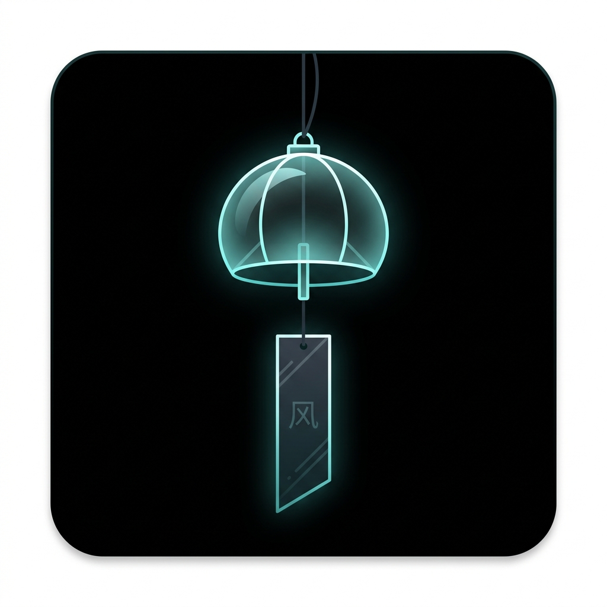

# T-Ornament / 桌面摆件 🎐

<div align="center">
  
  
  <p>将您的闲置手机变身为充满极简几何美学的桌面动态摆件</p>
  <p><em>Transform your phone into a dynamic, beautiful desktop ornament with minimalist geometric aesthetics</em></p>

  [](https://opensource.org/licenses/MIT)
  [](https://android.com)
  [](https://github.com/xiphoray/t-ornament/actions)
</div>

<br/>

[**English Version below**](#english-version)

## 📖 简介

**T-Ornament** 是一款全屏运行的桌面摆件应用。它的设计理念受《山 (Mountain)》启发，采用极简主义的几何视觉风格，让应用在静默中展现自然之美。不仅可以在工作时作为白噪音或视觉缓冲，也可以让废旧手机焕发新生。

目前已上线：**风铃 (Wind Chime)** 摆件。
物理引擎会根据随机的风力大小，驱动风铃和下方的便签纸 (Tanzaku) 产生符合真实物理反馈的晃动，彻底告别单调的循环动画。

## ✨ 特性

- **动态摆件**: 高度还原物理定律的动画（随风摇动的极简风铃）。
- **沉浸体验**: 全屏无边界设计，保持屏幕常亮。
- **极简美学**: 纯粹的纯色背景与几何线条，自动隐藏所有系统UI与设置按钮。
- **互动元素**: 点击屏幕即可唤起隐藏设置，同时会产生一阵微风吹动风铃。
- **性能优化**: 注意内存泄漏控制与动画性能限制，长时间挂机依然流畅如初。

## 🚀 安装与使用

1. 在 [Releases](../../releases) 页面下载最新版本的 `.apk` 文件。
2. 安装到您的 Android 设备上。
3. 打开应用，将手机放置在桌面的支架上，享受静谧时光。
4. **设置**: 点击屏幕任意位置呼出设置菜单，可切换纯黑或其他的护眼深色背景。设置面板会在数秒后自动隐藏。

## 🛠️ 构建与开发

本项目使用 Kotlin 与 Jetpack Compose 进行开发。

```bash
# 克隆仓库
git clone https://github.com/yourusername/t-ornament.git

# 使用 Gradle 编译 Debug 版本
./gradlew assembleDebug
```

---

<h2 id="english-version">🎐 English Version</h2>

## 📖 Introduction

**T-Ornament** is a full-screen desktop ornament application. Inspired by the minimalist geometry of the game "Mountain", it turns your phone into a silent, aesthetic display piece. Perfect for adding a calming visual to your workspace or giving a second life to an old smartphone.

Currently featuring: **Wind Chime (Fūrin)**.
The built-in physics engine simulates randomized wind forces, making the wind chime and its paper strip (Tanzaku) sway naturally—say goodbye to boring, repetitive looping animations.

## ✨ Features

- **Dynamic Ornaments**: Physics-driven animations (currently a minimalist geometric wind chime reacting to wind).
- **Immersive**: Full-screen mode, keeps the screen always on and prevents device sleep.
- **Minimalist Aesthetics**: Pure solid backgrounds with clean vector lines. Settings and buttons auto-hide for a distraction-free look.
- **Interactive**: Tap the screen to reveal the settings panel and simulate a sudden gust of wind.
- **Optimized**: Careful memory management and capped simulation ticks ensure smooth performance during long runs.

## 🚀 Usage

1. Download the latest `.apk` from the [Releases](../../releases) page.
2. Install the app on your Android device.
3. Open the app, place your phone on a stand on your desk, and enjoy.
4. **Settings**: Tap anywhere on the screen to reveal the hidden settings menu. You can switch between pure black and other dark themes. The panel will auto-hide after a few seconds.

## 🛠️ Development

Built with Kotlin and Jetpack Compose.

```bash
# Clone the repo
git clone https://github.com/yourusername/t-ornament.git

# Build debug APK via Gradle
./gradlew assembleDebug
```

## 📜 License

This project is licensed under the MIT License - see the [LICENSE](LICENSE) file for details.
